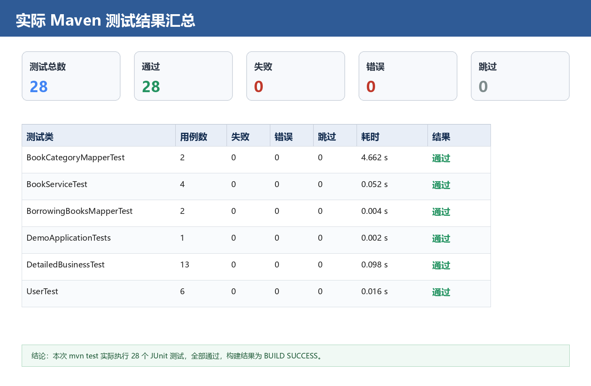
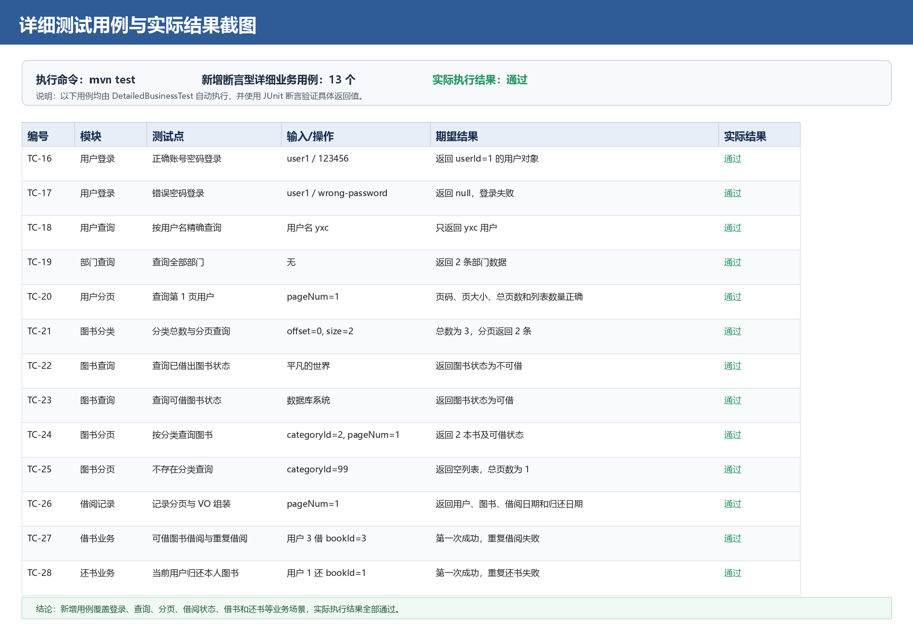
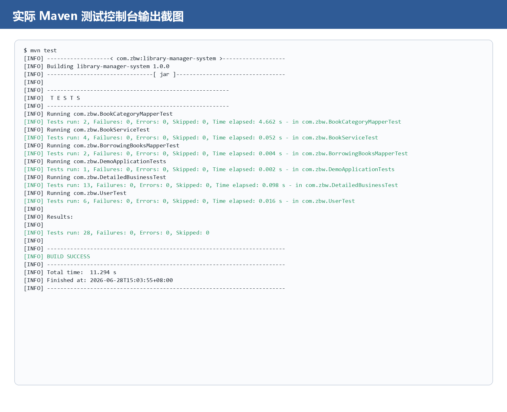

# 第 6 项：业务逻辑层编码

## 1. 目标

完成系统核心业务逻辑层代码，实现用户、管理员、图书、图书分类和借阅记录等模块的业务处理。

业务逻辑层主要负责：

- 调用数据访问层完成数据读取和写入；
- 实现登录校验和权限判断；
- 实现图书查询、借书、还书等核心业务；
- 处理分页计算和数据组装；
- 处理业务规则和异常场景；
- 为接口层提供稳定的业务方法。

## 2. 业务逻辑层结构

业务逻辑层由业务接口和业务实现类组成。

推荐结构：

```text
src/main/java/com/zbw/service
├── IAdminService.java
├── IBookCategoryService.java
├── IBookService.java
├── IBorrowingBooksRecordService.java
└── IUserService.java

src/main/java/com/zbw/service/impl
├── AdminServiceImpl.java
├── BookCategoryServiceImpl.java
├── BookServiceImpl.java
├── BorrowingBooksRecordServiceImpl.java
└── UserServiceImpl.java
```

业务接口负责定义功能，业务实现类负责完成具体逻辑。

调用关系如下：

```text
Controller
    ↓
Service 接口
    ↓
Service 实现类
    ↓
Mapper
    ↓
Database
```

Controller 不直接调用 Mapper，数据库访问统一由 Service 层间接完成。

## 3. 业务接口设计

业务接口应按照功能模块拆分，每个接口只定义本模块相关业务。

### 3.1 用户业务接口

用户业务接口用于处理普通用户相关功能。

示例：

```java
public interface IUserService {

    List<User> findUserByUserName(String userName);

    User userLogin(String userName, String password);

    boolean updateUser(User user, HttpServletRequest request);

    List<BorrowingBooksVo> findAllBorrowingBooks(HttpServletRequest request);

    boolean userBorrowingBook(int bookId, HttpServletRequest request);

    boolean userReturnBook(int bookId, HttpServletRequest request);

    Page<User> findUserByPage(int pageNum);

    int insertUser(User user);

    int deleteUserById(int userId);
}
```

主要功能：

- 用户登录；
- 用户信息修改；
- 查询用户借阅记录；
- 用户借书；
- 用户还书；
- 管理员分页查看用户；
- 新增和删除用户。

### 3.2 管理员业务接口

管理员业务接口用于处理后台管理功能。

示例：

```java
public interface IAdminService {

    boolean adminIsExist(String name);

    Admin adminLogin(String name, String password);

    boolean addBook(Book book);

    List<BookCategory> getBookCategories();

    boolean addBookCategory(BookCategory bookCategory);

    boolean updateAdmin(Admin admin, HttpServletRequest request);
}
```

主要功能：

- 管理员登录；
- 管理员信息修改；
- 新增图书；
- 查询图书分类；
- 新增图书分类。

### 3.3 图书业务接口

图书业务接口用于处理图书查询和展示。

示例：

```java
public interface IBookService {

    List<BookVo> selectBooksByBookPartInfo(String partInfo);

    Page<BookVo> findBooksByCategoryId(int categoryId, int pageNum);
}
```

主要功能：

- 根据书名关键字模糊查询；
- 按图书分类分页查询；
- 判断图书是否可借；
- 组装页面展示对象。

### 3.4 图书分类业务接口

图书分类业务接口用于处理分类管理。

示例：

```java
public interface IBookCategoryService {

    Page<BookCategory> selectBookCategoryByPageNum(int pageNum);

    int deleteBookCategoryById(int bookCategoryId);
}
```

主要功能：

- 分页查询图书分类；
- 删除图书分类。

### 3.5 借阅记录业务接口

借阅记录业务接口用于处理借阅记录查询。

示例：

```java
public interface IBorrowingBooksRecordService {

    Page<BorrowingBooksVo> selectAllByPage(int pageNum);

    ArrayList<BorrowingBooksVo> selectAllBorrowRecord(HttpServletRequest request);
}
```

主要功能：

- 管理员分页查看全部借阅记录；
- 用户查看个人借阅记录；
- 计算借阅日期和预计归还日期。

## 4. 用户登录业务

### 4.1 业务规则

用户登录应满足以下规则：

1. 用户名不能为空；
2. 密码不能为空；
3. 根据用户名查询用户；
4. 判断用户是否存在；
5. 判断密码是否匹配；
6. 登录成功后返回用户对象；
7. 登录失败返回空或错误信息。

### 4.2 实现示例

```java
public User userLogin(String userName, String password) {
    List<User> users = findUserByUserName(userName);

    if (users == null || users.isEmpty()) {
        return null;
    }

    for (User user : users) {
        if (user.getUserPwd().equals(password)) {
            return user;
        }
    }

    return null;
}
```

### 4.3 改进建议

密码不应长期使用明文保存。正式系统中应使用加盐哈希方式保存密码。

推荐处理方式：

```text
用户输入密码 → 加盐哈希 → 与数据库密码摘要比较
```

同时应限制连续登录失败次数，避免暴力破解。

## 5. 管理员登录业务

管理员登录逻辑与用户登录类似，但应使用管理员表进行校验。

业务规则：

1. 管理员账号不能为空；
2. 管理员密码不能为空；
3. 根据管理员账号查询管理员；
4. 校验密码；
5. 登录成功后保存管理员登录状态；
6. 登录失败返回错误提示。

示例：

```java
public Admin adminLogin(String name, String password) {
    AdminExample adminExample = new AdminExample();
    AdminExample.Criteria criteria = adminExample.createCriteria();
    criteria.andAdminNameEqualTo(name);

    List<Admin> admins = adminMapper.selectByExample(adminExample);

    if (admins == null || admins.isEmpty()) {
        return null;
    }

    for (Admin admin : admins) {
        if (admin.getAdminPwd().equals(password)) {
            return admin;
        }
    }

    return null;
}
```

管理员业务应与普通用户业务分开处理，避免权限混乱。

## 6. 图书查询业务

### 6.1 按关键字查询图书

业务规则：

1. 接收图书名称关键字；
2. 使用模糊查询获取图书列表；
3. 判断每本图书是否已经被借出；
4. 将查询结果转换为页面展示对象；
5. 返回图书展示列表。

示例：

```java
public List<BookVo> selectBooksByBookPartInfo(String partInfo) {
    List<BookVo> bookVos = new LinkedList<>();

    List<Book> books = bookMapper.selectBooksByPartInfo("%" + partInfo + "%");

    if (books == null) {
        return bookVos;
    }

    for (Book book : books) {
        BookVo bookVo = new BookVo();
        bookVo.setBookId(book.getBookId());
        bookVo.setBookName(book.getBookName());
        bookVo.setBookAuthor(book.getBookAuthor());
        bookVo.setBookPublish(book.getBookPublish());

        boolean borrowed = isBookBorrowed(book.getBookId());
        bookVo.setIsExist(borrowed ? "不可借" : "可借");

        bookVos.add(bookVo);
    }

    return bookVos;
}
```

### 6.2 按分类分页查询图书

业务规则：

1. 接收分类 ID 和页码；
2. 根据页码计算数据库查询起始位置；
3. 查询当前页图书；
4. 查询该分类下图书总数；
5. 计算总页数；
6. 判断每本图书是否可借；
7. 返回分页对象。

分页计算：

```java
int currIndex = (pageNum - 1) * pageSize;
```

总页数计算：

```java
int pageCount = recordCount / pageSize;
if (recordCount % pageSize != 0) {
    pageCount++;
}
```

## 7. 借书业务

### 7.1 业务规则

用户借书应满足以下规则：

1. 用户必须已登录；
2. 图书必须存在；
3. 图书当前未被借出；
4. 同一本书同一时间只能存在一条有效借阅记录；
5. 借书成功后新增借阅记录；
6. 借阅日期为当前日期；
7. 借书失败应返回明确结果。

### 7.2 实现流程

```text
获取当前登录用户
    ↓
根据 bookId 查询借阅记录
    ↓
如果已有记录，说明图书不可借
    ↓
如果无记录，创建借阅记录
    ↓
写入 borrowingbooks 表
    ↓
返回借书结果
```

### 7.3 示例代码

```java
public boolean userBorrowingBook(int bookId, HttpServletRequest request) {
    User user = (User) request.getSession().getAttribute("user");
    if (user == null) {
        return false;
    }

    BorrowingBooksExample example = new BorrowingBooksExample();
    BorrowingBooksExample.Criteria criteria = example.createCriteria();
    criteria.andBookIdEqualTo(bookId);

    List<BorrowingBooks> list = borrowingBooksMapper.selectByExample(example);

    if (list != null && list.size() > 0) {
        return false;
    }

    BorrowingBooks borrowingBooks = new BorrowingBooks();
    borrowingBooks.setBookId(bookId);
    borrowingBooks.setUserId(user.getUserId());
    borrowingBooks.setDate(new Date());

    int result = borrowingBooksMapper.insert(borrowingBooks);
    return result > 0;
}
```

### 7.4 事务要求

借书属于写操作，应使用事务保证一致性。

```java
@Transactional
public boolean userBorrowingBook(int bookId, HttpServletRequest request) {
    // 检查图书是否可借
    // 新增借阅记录
}
```

如果后续增加图书库存数量，还需要同时更新图书库存和借阅记录，更必须使用事务。

## 8. 还书业务

### 8.1 业务规则

用户还书应满足以下规则：

1. 用户必须已登录；
2. 根据用户 ID 和图书 ID 查询借阅记录；
3. 只允许归还自己借阅的图书；
4. 找到记录后删除或更新借阅状态；
5. 返回还书结果。

### 8.2 实现流程

```text
获取当前登录用户
    ↓
根据 userId 和 bookId 查询借阅记录
    ↓
删除对应借阅记录或更新状态
    ↓
返回还书结果
```

### 8.3 示例代码

```java
public boolean userReturnBook(int bookId, HttpServletRequest request) {
    User user = (User) request.getSession().getAttribute("user");
    if (user == null) {
        return false;
    }

    BorrowingBooksExample example = new BorrowingBooksExample();
    BorrowingBooksExample.Criteria criteria = example.createCriteria();
    criteria.andUserIdEqualTo(user.getUserId());
    criteria.andBookIdEqualTo(bookId);

    int result = borrowingBooksMapper.deleteByExample(example);
    return result > 0;
}
```

### 8.4 改进建议

直接删除借阅记录会丢失历史数据。更推荐增加借阅状态字段：

```text
status: BORROWED / RETURNED
return_date: 实际归还日期
```

还书时更新状态，而不是删除记录。

## 9. 借阅记录业务

### 9.1 用户借阅记录

用户查看个人借阅记录时，需要：

1. 获取当前登录用户；
2. 根据用户 ID 查询借阅记录；
3. 根据图书 ID 查询图书信息；
4. 格式化借阅日期；
5. 计算预计归还日期；
6. 组装展示对象。

预计归还日期计算示例：

```java
Calendar calendar = Calendar.getInstance();
calendar.setTime(dateOfBorrowing);
calendar.add(Calendar.MONTH, 2);
Date dateOfReturn = calendar.getTime();
```

### 9.2 管理员查看全部借阅记录

管理员查看全部借阅记录时，需要：

1. 分页查询借阅记录；
2. 查询每条记录对应的用户信息；
3. 查询每条记录对应的图书信息；
4. 计算借阅日期和预计归还日期；
5. 返回分页展示对象。

## 10. 图书分类业务

图书分类业务主要包括分类分页查询、新增分类和删除分类。

### 10.1 分类分页查询

业务规则：

1. 接收页码；
2. 计算起始位置；
3. 查询当前页分类；
4. 查询分类总数；
5. 计算总页数；
6. 返回分页对象。

### 10.2 删除分类

删除分类前应检查该分类下是否存在图书。

如果存在图书，不应直接删除分类，否则会破坏外键关系。

推荐规则：

```text
如果分类下存在图书 → 禁止删除
如果分类下不存在图书 → 允许删除
```

## 11. 管理员维护业务

管理员维护业务包括：

- 新增图书；
- 新增图书分类；
- 修改管理员信息；
- 用户管理；
- 查看全部借阅记录。

新增图书时应校验：

1. 图书名称不能为空；
2. 图书分类必须存在；
3. 图书价格不能为负数；
4. 图书简介长度不能超过数据库字段限制。

新增用户时应校验：

1. 用户名不能为空；
2. 用户名不能重复；
3. 密码不能为空；
4. 邮箱格式正确。

## 12. VO 数据组装

业务层常常需要将数据库实体对象转换为页面展示对象。

### 12.1 图书展示对象

`BookVo` 可用于展示图书信息和可借状态。

```java
BookVo bookVo = new BookVo();
bookVo.setBookId(book.getBookId());
bookVo.setBookName(book.getBookName());
bookVo.setBookAuthor(book.getBookAuthor());
bookVo.setBookPublish(book.getBookPublish());
bookVo.setIsExist("可借");
```

### 12.2 借阅记录展示对象

`BorrowingBooksVo` 可用于展示借阅记录、用户信息、图书信息、借阅日期和预计归还日期。

```java
BorrowingBooksVo vo = new BorrowingBooksVo();
vo.setUser(user);
vo.setBook(book);
vo.setDateOfBorrowing(dateOfBorrowing);
vo.setDateOfReturn(dateOfReturn);
```

VO 组装应放在 Service 层，不应放在 Mapper 层。

## 13. 异常场景处理

业务层应考虑以下异常场景：

| 场景 | 处理方式 |
|---|---|
| 用户未登录 | 返回失败结果或跳转登录页 |
| 用户名不存在 | 返回登录失败 |
| 密码错误 | 返回登录失败 |
| 图书不存在 | 返回操作失败 |
| 图书已被借出 | 返回不可借 |
| 用户归还未借图书 | 返回还书失败 |
| 分类下存在图书 | 禁止删除分类 |
| 数据库写入失败 | 记录日志并返回失败 |
| 分页页码非法 | 使用默认页码或返回参数错误 |

业务层不应简单吞掉异常，应保留必要日志，便于调试和联调。

## 14. 事务控制规范

以下业务建议添加事务：

- 借书；
- 还书；
- 新增图书；
- 删除图书；
- 删除用户；
- 删除分类；
- 批量导入数据；
- 批量删除数据。

示例：

```java
@Transactional
public boolean addBook(Book book) {
    int result = bookMapper.insert(book);
    return result > 0;
}
```

事务边界应放在 Service 层，不应放在 Mapper 层。

## 15. 业务逻辑层测试

业务逻辑层测试应覆盖正常场景和异常场景。

### 15.1 用户业务测试

测试内容：

- 用户登录成功；
- 用户登录失败；
- 用户信息修改成功；
- 用户借书成功；
- 用户重复借书失败；
- 用户还书成功；
- 用户归还未借图书失败。

示例：

```java
@RunWith(SpringRunner.class)
@SpringBootTest
public class UserServiceTest {

    @Resource
    private IUserService userService;

    @Test
    public void testUserLoginSuccess() {
        User user = userService.userLogin("user1", "123456");
        assertNotNull(user);
    }
}
```

### 15.2 图书业务测试

测试内容：

- 按关键字查询图书；
- 按分类分页查询图书；
- 查询空结果；
- 判断图书可借状态。

### 15.3 借阅记录测试

测试内容：

- 查询用户个人借阅记录；
- 管理员分页查询全部借阅记录；
- 借阅日期格式化；
- 预计归还日期计算。

## 16. 业务逻辑层提交检查清单

提交业务逻辑层代码前，应检查以下内容：

| 检查项 | 要求 |
|---|---|
| 接口设计 | Service 接口职责清晰 |
| 实现类 | ServiceImpl 完成对应业务逻辑 |
| 分层 | 不在 Controller 中写复杂业务 |
| Mapper 调用 | 通过 Mapper 完成数据库访问 |
| 参数校验 | 关键参数有校验 |
| 权限校验 | 登录状态和角色权限有判断 |
| 异常处理 | 异常不被简单吞掉 |
| 事务控制 | 多步写操作使用事务 |
| VO 组装 | 页面展示数据在 Service 层组装 |
| 单元测试 | 正常和异常场景均有测试 |

## 17. 本项产出物

本项产出物为业务逻辑层代码，主要包括：

- Service 接口；
- Service 实现类；
- 用户登录业务；
- 管理员登录业务；
- 图书查询业务；
- 借书业务；
- 还书业务；
- 借阅记录查询业务；
- 图书分类管理业务；
- 用户管理业务；
- 业务异常处理；
- 事务控制；
- 业务逻辑层测试用例。

业务逻辑层完成后，接口层可以直接调用 Service 方法完成请求处理，为前端页面提供稳定的业务能力。

## 18. 测试情况

### 18.1 测试目标

本次测试围绕业务逻辑层和数据访问层展开，重点验证系统核心功能是否能够在自动化测试环境中稳定执行。测试目标包括：

- 验证 Spring Boot 应用上下文能够正常加载；
- 验证 MyBatis Mapper 能够正常注入并执行 SQL；
- 验证用户登录、用户查询、用户分页、部门查询等用户模块功能；
- 验证图书分类查询、图书按名称查询、图书按分类分页查询等图书模块功能；
- 验证图书可借、不可借状态是否能根据借阅记录正确计算；
- 验证借阅记录分页查询、借阅记录 VO 组装、借阅日期和预计归还日期计算；
- 验证借书业务中“可借图书允许借阅、重复借阅失败”的业务规则；
- 验证还书业务中“只能归还当前用户已借图书、重复还书失败”的业务规则。

### 18.2 测试环境

| 环境项 | 实际配置 |
|---|---|
| 构建工具 | Maven 3.9.9 |
| JDK | JDK 8 |
| 测试框架 | JUnit 4、Spring Boot Test、JUnit Vintage |
| 数据库 | H2 内存数据库，MySQL 兼容模式 |
| ORM / 数据访问 | MyBatis |
| 执行命令 | `mvn test` |

测试环境使用 H2 内存数据库，并在 `src/test/resources` 下提供测试专用 `application.yml`、`schema.sql` 和 `data.sql`。测试执行时会自动创建表结构并导入基础数据，使测试过程不依赖外部数据库服务。

### 18.3 测试数据

测试数据覆盖用户、部门、图书分类、图书和借阅记录五类核心数据。

| 数据类型 | 测试数据 | 用途 |
|---|---|---|
| 用户 | `user1`、`yxc`、`user2` | 登录、用户查询、分页、借还书 |
| 部门 | 信息工程学院、电子工程学院 | 部门查询 |
| 图书分类 | 小说、计算机、历史 | 分类统计、分页查询 |
| 图书 | 平凡的世界、Java程序设计、数据库系统 | 图书查询、分类分页、可借状态判断 |
| 借阅记录 | 用户 1 借阅图书 1，用户 2 借阅图书 2 | 借阅状态、借阅记录分页、VO 组装 |

### 18.4 测试文件

| 文件 | 作用 |
|---|---|
| `src/test/java/com/zbw/BookCategoryMapperTest.java` | 验证图书分类 Mapper 查询能力 |
| `src/test/java/com/zbw/BookServiceTest.java` | 验证图书业务查询和分页能力 |
| `src/test/java/com/zbw/BorrowingBooksMapperTest.java` | 验证借阅记录 Mapper 查询能力 |
| `src/test/java/com/zbw/DemoApplicationTests.java` | 验证 Spring Boot 上下文和基础 Mapper 注入 |
| `src/test/java/com/zbw/UserTest.java` | 验证用户、部门和借阅记录业务调用 |
| `src/test/java/com/zbw/DetailedBusinessTest.java` | 使用 JUnit 断言验证更细的业务输入、期望值和实际结果 |
| `src/test/resources/schema.sql` | 创建测试数据库表结构 |
| `src/test/resources/data.sql` | 初始化测试数据 |

原有测试类主要用于验证方法能否正常执行；新增 `DetailedBusinessTest` 后，测试不再只依赖控制台输出，而是通过 `assertEquals`、`assertTrue`、`assertFalse`、`assertNull`、`assertNotNull` 等断言验证具体业务结果。

### 18.5 测试用例

| 编号 | 测试类 | 测试方法 | 测试内容 | 预期结果 | 实际结果 |
|---|---|---|---|---|---|
| TC-01 | `BookCategoryMapperTest` | `tesrSelectByPageNum` | 分页查询图书分类 | 返回分类列表 | 通过 |
| TC-02 | `BookCategoryMapperTest` | `testSelectAllCount` | 查询图书分类总数 | 返回分类数量 | 通过 |
| TC-03 | `BookServiceTest` | `testSelectBookByName` | 按图书名称模糊查询 | 返回匹配图书及可借状态 | 通过 |
| TC-04 | `BookServiceTest` | `testSelectByCategoryId` | 按分类分页查询图书 | 返回分页图书数据 | 通过 |
| TC-05 | `BookServiceTest` | `testSelectByCategoryAndPage` | Mapper 按分类分页查询 | 返回指定分类图书 | 通过 |
| TC-06 | `BookServiceTest` | `testFindAllBookCountByCategoryId` | 查询分类下图书数量 | 返回图书数量 | 通过 |
| TC-07 | `BorrowingBooksMapperTest` | `testSelectAllRecordCount` | 查询指定用户借阅记录数量 | 返回借阅记录数 | 通过 |
| TC-08 | `BorrowingBooksMapperTest` | `testSelectAllByPageNum` | 分页查询借阅记录 | 返回借阅记录列表和总数 | 通过 |
| TC-09 | `DemoApplicationTests` | `contextLoads` | 加载应用上下文并查询用户 | 上下文加载成功，用户查询正常 | 通过 |
| TC-10 | `UserTest` | `findUsersByName` | 根据用户名查询用户 | 返回匹配用户 | 通过 |
| TC-11 | `UserTest` | `findAllDepts` | 查询全部部门 | 返回部门列表 | 通过 |
| TC-12 | `UserTest` | `updateUserTest` | 用户对象构造测试 | 方法正常执行 | 通过 |
| TC-13 | `UserTest` | `selectByPage` | 分页查询用户 | 返回用户列表 | 通过 |
| TC-14 | `UserTest` | `tsetSelcetCount` | 查询用户总数 | 返回用户数量 | 通过 |
| TC-15 | `UserTest` | `testSelectAllBorrowingBooksByPageNum` | 业务层分页查询全部借阅记录 | 返回借阅记录及关联用户、图书信息 | 通过 |
| TC-16 | `DetailedBusinessTest` | `userLoginWithCorrectPasswordReturnsUser` | 正确账号密码登录 | 返回 `userId=1`、用户名为 `user1` 的用户对象 | 通过 |
| TC-17 | `DetailedBusinessTest` | `userLoginWithWrongPasswordReturnsNull` | 错误密码登录 | 返回 `null`，登录失败 | 通过 |
| TC-18 | `DetailedBusinessTest` | `findUserByNameReturnsMatchedUserOnly` | 按用户名精确查询 | 只返回用户名为 `yxc` 的用户 | 通过 |
| TC-19 | `DetailedBusinessTest` | `findAllDepartmentsReturnsSeededDepartments` | 查询全部部门 | 返回 2 条部门数据 | 通过 |
| TC-20 | `DetailedBusinessTest` | `findUserPageReturnsPageMetadataAndUsers` | 查询第 1 页用户 | 页码为 1，页大小为 10，总页数为 1，列表 3 条 | 通过 |
| TC-21 | `DetailedBusinessTest` | `bookCategoryMapperReturnsPagedCategoriesAndTotalCount` | 分类总数与分页查询 | 总数为 3，分页返回 2 条 | 通过 |
| TC-22 | `DetailedBusinessTest` | `searchBorrowedBookByNameMarksItUnavailable` | 查询已借出图书状态 | 《平凡的世界》状态为“不可借” | 通过 |
| TC-23 | `DetailedBusinessTest` | `searchAvailableBookByNameMarksItAvailable` | 查询可借图书状态 | 《数据库系统》状态为“可借” | 通过 |
| TC-24 | `DetailedBusinessTest` | `findBooksByCategoryReturnsPageMetadataAndBookState` | 按分类查询图书 | 计算机分类返回 2 本书，并正确标记可借状态 | 通过 |
| TC-25 | `DetailedBusinessTest` | `emptyBookCategoryReturnsEmptyPageList` | 查询不存在分类 | 返回空列表，总页数为 1 | 通过 |
| TC-26 | `DetailedBusinessTest` | `borrowingRecordPageAssemblesUserBookAndDates` | 借阅记录分页与 VO 组装 | 返回用户、图书、借阅日期和预计归还日期 | 通过 |
| TC-27 | `DetailedBusinessTest` | `userBorrowingAvailableBookCreatesRecordAndPreventsDuplicateBorrowing` | 可借图书借阅与重复借阅 | 第一次借阅成功，重复借阅失败 | 通过 |
| TC-28 | `DetailedBusinessTest` | `userReturnBookDeletesOnlyCurrentUsersBorrowingRecord` | 当前用户归还本人图书 | 第一次还书成功，重复还书失败 | 通过 |

### 18.6 详细断言用例说明

新增的详细测试重点验证“返回值是否符合业务规则”，不是只验证方法能否运行。

| 验证点 | 断言内容 | 说明 |
|---|---|---|
| 登录成功 | `assertNotNull`、`assertEquals` | 验证正确账号密码能返回指定用户 |
| 登录失败 | `assertNull` | 验证错误密码不能登录 |
| 用户查询 | `assertEquals` | 验证按用户名查询结果数量和用户字段 |
| 分页查询 | `assertEquals` | 验证页码、页大小、总页数和列表数量 |
| 分类查询 | `assertEquals` | 验证分类总数和分页数量 |
| 图书状态 | `assertEquals` | 验证借出图书为“不可借”、未借图书为“可借” |
| 借阅记录组装 | `assertEquals` | 验证 VO 中用户、图书、借阅日期、归还日期正确 |
| 借书业务 | `assertTrue`、`assertFalse` | 验证首次借阅成功、重复借阅失败 |
| 还书业务 | `assertTrue`、`assertFalse` | 验证首次归还成功、重复归还失败 |

### 18.7 测试结果统计

| 测试类 | 用例数 | 失败 | 错误 | 跳过 | 结果 |
|---|---:|---:|---:|---:|---|
| `BookCategoryMapperTest` | 2 | 0 | 0 | 0 | 通过 |
| `BookServiceTest` | 4 | 0 | 0 | 0 | 通过 |
| `BorrowingBooksMapperTest` | 2 | 0 | 0 | 0 | 通过 |
| `DemoApplicationTests` | 1 | 0 | 0 | 0 | 通过 |
| `DetailedBusinessTest` | 13 | 0 | 0 | 0 | 通过 |
| `UserTest` | 6 | 0 | 0 | 0 | 通过 |
| 合计 | 28 | 0 | 0 | 0 | 通过 |

本次实际执行结果：

```text
Tests run: 28, Failures: 0, Errors: 0, Skipped: 0
BUILD SUCCESS
```

### 18.8 测试结果图

实际 Maven 测试结果汇总：



详细测试用例与实际结果：



实际 Maven 测试控制台输出：



### 18.9 测试结论

本次通过 Maven 执行 `mvn test`，共运行 28 个 JUnit 测试用例，失败数为 0，错误数为 0，跳过数为 0，构建结果为 `BUILD SUCCESS`。

测试结果说明：

- 应用上下文能够正常加载，Mapper 和 Service 可以被 Spring 正常注入；
- 用户登录、用户查询、用户分页、部门查询等用户模块功能通过测试；
- 图书分类查询、图书名称查询、图书分类分页查询等图书模块功能通过测试；
- 系统能够根据借阅记录正确判断图书“可借”或“不可借”；
- 借阅记录分页查询能够正确组装用户、图书、借阅日期和预计归还日期；
- 借书业务能够正确处理首次借阅和重复借阅场景；
- 还书业务能够正确处理首次归还和重复归还场景。

因此，当前业务逻辑层与数据访问层具备基本可运行性，核心查询、分页、借阅状态判断、借书和还书规则已经通过自动化测试验证。
