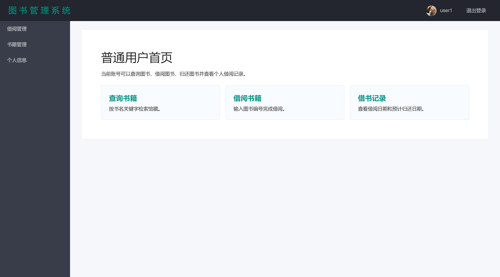
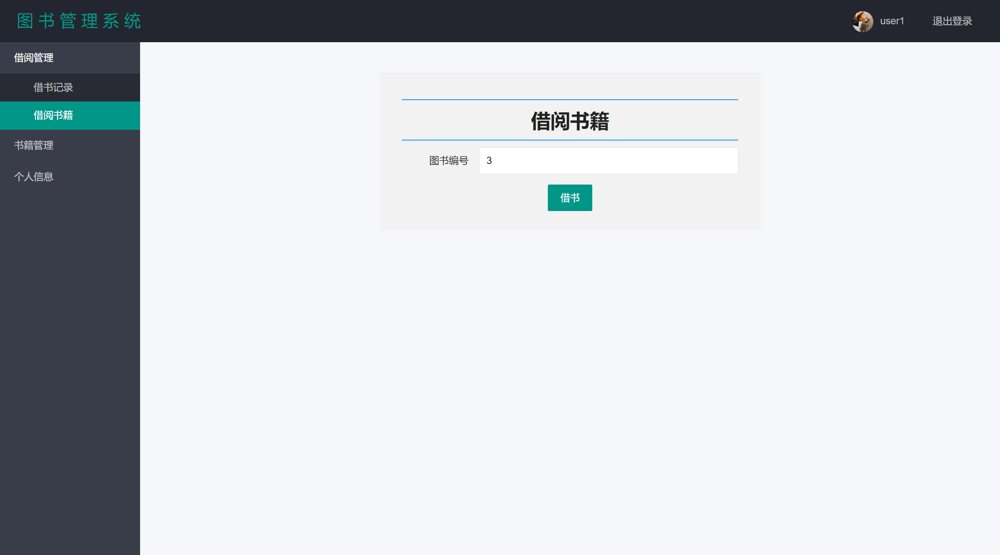
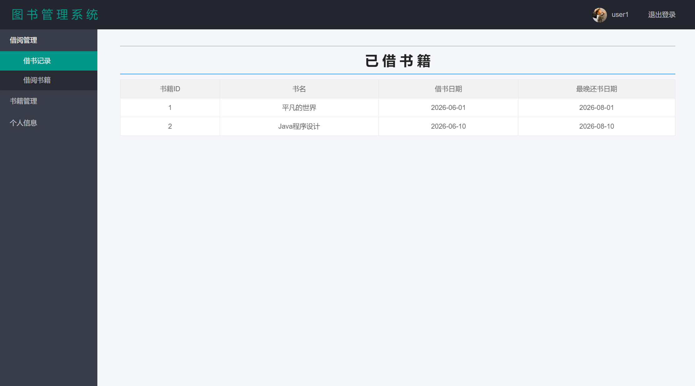
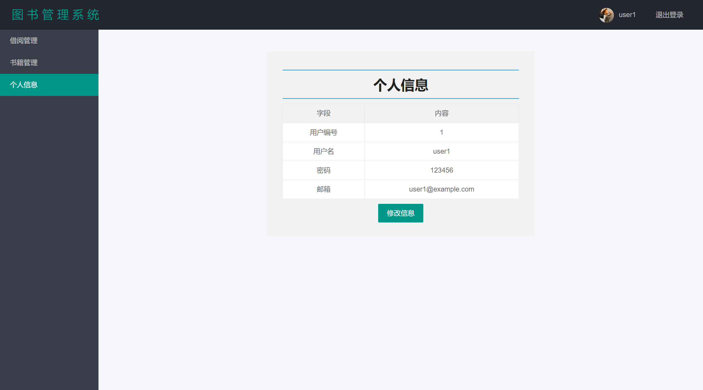
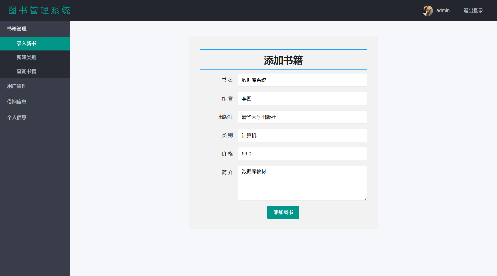
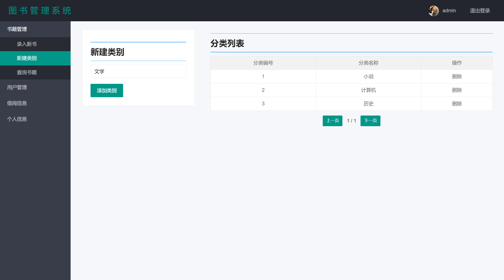
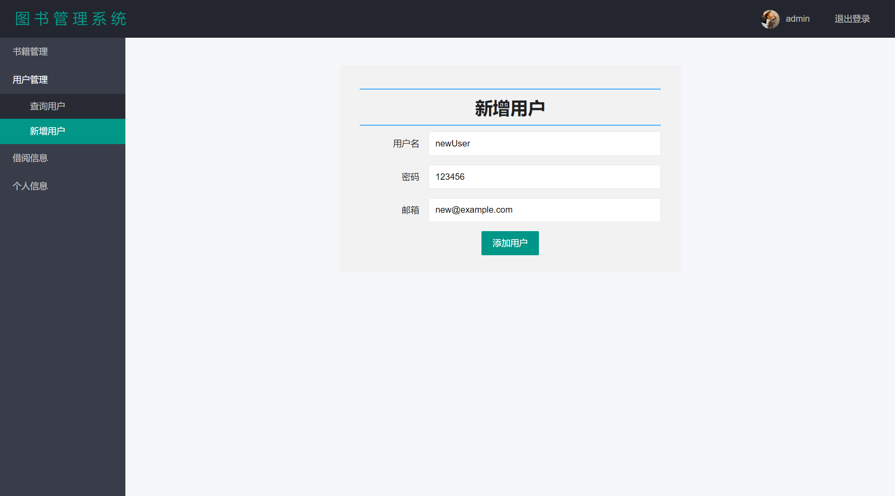
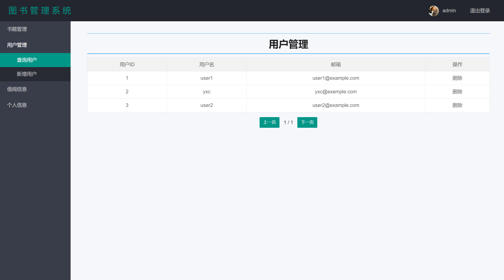
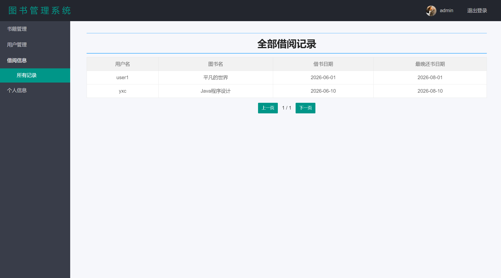
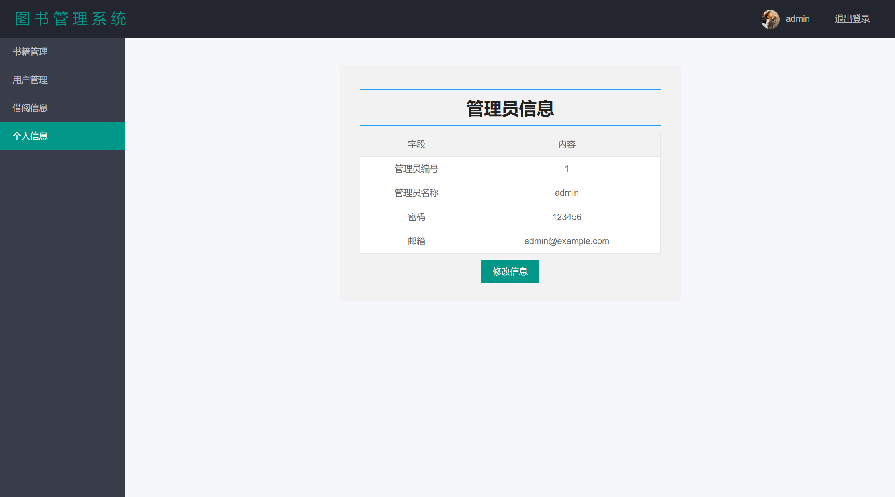

# 第 9 项：前端页面布局

## 1. 目标

前端页面布局用于完成系统主要页面的静态结构设计，使用户能够通过浏览器完成登录、图书查询、借书、还书、个人信息查看、后台管理、分类维护、用户管理和借阅记录查看等操作。

本项重点完成以下内容：

- 设计登录页布局；
- 设计普通用户端页面布局；
- 设计管理员端页面布局；
- 抽取公共头部和页脚；
- 统一导航栏、内容区、表单、表格和分页样式；
- 使用 Thymeleaf 绑定后端返回数据；
- 使用 Layui 组件完成基础 UI；
- 形成前端静态页面代码说明。

## 2. 技术路线

本系统前端页面采用 Thymeleaf + Layui + jQuery 实现。

| 技术 | 作用 |
|---|---|
| Thymeleaf | 服务端模板渲染，绑定后端传入的数据 |
| Layui | 页面布局、导航、表单、按钮、表格、弹窗等 UI 组件 |
| jQuery | DOM 操作和 AJAX 请求 |
| CSS | 自定义页面样式 |
| HTML | 页面结构 |

整体页面渲染流程如下：

```text
Controller 返回页面名称
    -> Thymeleaf 渲染 HTML 模板
    -> 页面加载 Layui / jQuery / CSS
    -> 用户在浏览器中操作页面
    -> 表单提交或 AJAX 请求后端接口
```

## 3. 前端目录结构

前端页面主要放在模板目录和静态资源目录中。

```text
src/main/resources/templates
├── index.html
├── common
│   ├── admin_header.html
│   ├── user_header.html
│   └── footer.html
├── user
│   ├── index.html
│   ├── findBook.html
│   ├── borrowingBooks.html
│   ├── returnBooks.html
│   ├── borrowingBooksRecord.html
│   └── userMessage.html
└── admin
    ├── index.html
    ├── addBook.html
    ├── addCategory.html
    ├── addUser.html
    ├── showBooks.html
    ├── showUsers.html
    ├── allBorrowingBooksRecord.html
    └── adminInfo.html

src/main/resources/static
├── css
├── images
├── layui
└── scripts
```

目录分工如下：

| 目录 | 作用 |
|---|---|
| `templates/common` | 公共头部、页脚 |
| `templates/user` | 普通用户页面 |
| `templates/admin` | 管理员页面 |
| `static/css` | 自定义样式 |
| `static/images` | 背景资源、头像资源等静态资源 |
| `static/layui` | Layui 前端组件库 |
| `static/scripts` | 页面交互脚本 |

## 4. 页面整体布局规范

登录后的页面统一采用 Layui 后台管理布局。

标准结构如下：

```html
<div class="layui-layout layui-layout-admin">
    <div th:include="common/user_header :: header"></div>

    <div class="layui-side layui-bg-black">
        <div class="layui-side-scroll">
            <!-- 左侧导航 -->
        </div>
    </div>

    <div class="layui-body layui-container">
        <!-- 页面主要内容 -->
    </div>

    <div th:include="common/footer :: footer"></div>
</div>
```

该结构包含四个区域：

| 区域 | 说明 |
|---|---|
| 顶部区域 | 展示系统名称、当前登录用户和退出入口 |
| 左侧导航区 | 展示当前身份可访问的功能菜单 |
| 主内容区 | 展示表单、表格、查询结果和分页 |
| 页脚区域 | 公共底部信息 |

## 5. 登录页布局

登录页为系统入口，采用背景图 + 居中登录表单布局。

页面文件：

```text
templates/index.html
```

页面组成：

| 组件 | 说明 |
|---|---|
| 背景区域 | 使用背景图铺满页面 |
| 登录表单容器 | 固定宽高，居中显示 |
| 用户名输入框 | 输入 `userName` |
| 密码输入框 | 输入 `password` |
| 身份选择 | 学生 / 管理员 |
| 登录按钮 | 根据身份提交到不同接口 |
| 错误提示 | 登录失败时弹出提示 |

登录页布局代码要点：

```html
<form class="layui-form" id="my_form" method="post" action="/userLogin">
    <input type="text" name="userName" placeholder="请输入用户名" class="layui-input">
    <input type="password" name="password" placeholder="请输入密码" class="layui-input">
    <input type="radio" name="role" value="1" title="学生" checked>
    <input type="radio" name="role" value="0" title="管理员">
    <button id="sub_btn" class="layui-btn layui-btn-normal">登录</button>
</form>
```

登录按钮逻辑：

| 选择身份 | 表单提交地址 |
|---|---|
| 学生 | `/userLogin` |
| 管理员 | `/adminLogin` |

页面校验规则：

- 用户名不能为空；
- 密码不能为空；
- 根据角色切换提交接口；
- 登录失败时读取 Session 中的失败标记并提示。

## 6. 公共头部布局

普通用户和管理员页面均有顶部头部区域，但显示的登录对象不同。

### 6.1 普通用户头部

页面文件：

```text
templates/common/user_header.html
```

显示内容：

| 元素 | 数据来源 |
|---|---|
| 系统名称 | 固定文本 |
| 用户头像 | 静态头像资源 |
| 用户名 | `session.user.getUserName()` |
| 退出登录 | `/userLogOut` |

核心代码：

```html
<span th:text="${session.user.getUserName()}"></span>
<a href="/userLogOut">退出登录</a>
```

### 6.2 管理员头部

页面文件：

```text
templates/common/admin_header.html
```

显示内容：

| 元素 | 数据来源 |
|---|---|
| 系统名称 | 固定文本 |
| 管理员头像 | 静态头像资源 |
| 管理员名称 | `session.admin.getAdminName()` |
| 退出登录 | `/adminLogOut` |

核心代码：

```html
<span th:text="${session.admin.getAdminName()}"></span>
<a href="/adminLogOut">退出登录</a>
```

## 7. 普通用户端页面布局

普通用户端主要包含图书查询、借书、还书、借阅记录和个人信息等页面。

### 7.1 用户端导航结构

用户端左侧导航分为三个模块：

| 导航模块 | 子功能 | 路由 |
|---|---|---|
| 借阅管理 | 借书记录 | `/userBorrowBookRecord` |
| 借阅管理 | 借阅书籍 | `/borrowingPage` |
| 书籍管理 | 归还书籍 | `/userReturnBooksPage` |
| 书籍管理 | 查询书籍 | `/findBookPage` |
| 个人信息 | 个人信息 | `/userMessagePage` |

导航使用 Layui 垂直导航组件：

```html
<ul class="layui-nav layui-nav-tree">
    <li class="layui-nav-item layui-nav-itemed">
        <a href="javascript:;">借阅管理</a>
        <dl class="layui-nav-child">
            <dd><a href="/userBorrowBookRecord">借书记录</a></dd>
            <dd><a href="/borrowingPage">借阅书籍</a></dd>
        </dl>
    </li>
</ul>
```

### 7.2 用户首页

页面文件：

```text
templates/user/index.html
```

页面作用：

- 作为普通用户登录后的首页；
- 展示用户端功能入口；
- 使用统一头部、侧边栏和内容区布局。

### 7.3 图书查询页

页面文件：

```text
templates/user/findBook.html
```

布局结构：

| 区域 | 内容 |
|---|---|
| 左侧内容区 | 图书名称查询表单 |
| 右侧内容区 | 查询结果表格 |

查询表单：

```html
<form class="layui-form" action="/findBookByBookPartInfo" id="findBookByNameForm">
    <input placeholder="请输入书名信息" class="layui-input"
           type="text" name="bookPartInfo" lay-verify="required">
    <input class="layui-btn" type="submit" value="查询">
</form>
```

查询结果表格：

| 列名 | 绑定字段 |
|---|---|
| 书籍编号 | `book.getBookId()` |
| 书名 | `book.getBookName()` |
| 作者 | `book.getBookAuthor()` |
| 出版社 | `book.getBookPublish()` |
| 状态 | `book.getIsExist()` |

Thymeleaf 循环：

```html
<tr th:each="book:${bookList}">
    <td><label th:text="${book.getBookId()}"></label></td>
    <td><label th:text="${book.getBookName()}"></label></td>
    <td><label th:text="${book.getBookAuthor()}"></label></td>
    <td><label th:text="${book.getBookPublish()}"></label></td>
    <td><label th:text="${book.getIsExist()}"></label></td>
</tr>
```

### 7.4 借书页面

页面文件：

```text
templates/user/borrowingBooks.html
```

页面功能：

- 输入图书编号；
- 点击按钮后通过 AJAX 调用借书接口；
- 根据返回结果提示借书成功或失败。

交互脚本：

```text
static/scripts/user/borrowingBook.js
```

接口：

```text
/userBorrowingBook
```

布局组件：

| 组件 | 作用 |
|---|---|
| 图书编号输入框 | 输入要借阅的图书 ID |
| 借书按钮 | 触发 AJAX 请求 |
| Layui 弹窗提示 | 显示借书结果 |

### 7.5 还书页面

页面文件：

```text
templates/user/returnBooks.html
```

页面功能：

- 输入图书编号；
- 点击按钮后调用还书接口；
- 返回成功后清空输入框。

交互脚本：

```text
static/scripts/user/returnBook.js
```

接口：

```text
/userReturnBook
```

### 7.6 借阅记录页面

页面文件：

```text
templates/user/borrowingBooksRecord.html
```

页面功能：

- 展示当前用户已经借阅的图书；
- 展示借书日期和最晚还书日期。

表格列：

| 列名 | 数据来源 |
|---|---|
| 书籍 ID | `borrowingBooks.getBook().getBookId()` |
| 书名 | `borrowingBooks.getBook().getBookName()` |
| 借书日期 | `borrowingBooks.getDateOfBorrowing()` |
| 最晚还书日期 | `borrowingBooks.getDateOfReturn()` |

### 7.7 用户信息页面

页面文件：

```text
templates/user/userMessage.html
```

页面功能：

- 展示当前用户编号、用户名、密码和邮箱；
- 提供修改信息弹窗；
- 修改后通过 AJAX 提交。

交互脚本：

```text
static/scripts/user/userMessage.js
```

接口：

```text
/updateUser
```

## 8. 管理员端页面布局

管理员端主要用于维护图书、分类、用户和借阅记录。

### 8.1 管理员端导航结构

管理员端左侧导航分为四个模块：

| 导航模块 | 子功能 | 路由 |
|---|---|---|
| 书籍管理 | 录入新书 | `/addBookPage` |
| 书籍管理 | 新建类别 | `/addCategoryPage?pageNum=1` |
| 书籍管理 | 查询书籍 | `/showBooksPage` |
| 用户管理 | 查询用户 | `/showUsersPage?pageNum=1` |
| 用户管理 | 新增用户 | `/addUserPage` |
| 借阅信息 | 所有记录 | `/allBorrowBooksRecordPage?pageNum=1` |
| 个人信息 | 管理员信息 | `/adminInfoPage` |

### 8.2 管理员首页

页面文件：

```text
templates/admin/index.html
```

页面作用：

- 管理员登录成功后的首页；
- 提供后台功能入口；
- 使用管理员头部和管理员导航。

### 8.3 新增图书页面

页面文件：

```text
templates/admin/addBook.html
```

页面布局：

- 中间表单容器；
- 使用 Layui 表单样式；
- 表单字段纵向排列；
- 提供图书分类下拉框。

表单字段：

| 字段 | name | 校验 |
|---|---|---|
| 书名 | `bookName` | 必填 |
| 作者 | `bookAuthor` | 必填 |
| 出版社 | `bookPublish` | 必填 |
| 类别 | `bookCategory` | 必选 |
| 价格 | `bookPrice` | 数字 |
| 简介 | `bookIntroduction` | 必填 |

页面脚本：

```text
static/scripts/admin/addBook.js
```

页面加载时会调用 `/findAllBookCategory`，将图书分类填充到下拉框。

### 8.4 图书分类维护页面

页面文件：

```text
templates/admin/addCategory.html
```

页面功能：

- 新增图书分类；
- 分页展示已有分类；
- 删除分类。

页面组件：

| 组件 | 作用 |
|---|---|
| 分类名称输入框 | 输入新分类名称 |
| 添加按钮 | 调用新增分类接口 |
| 分类表格 | 展示已有分类 |
| 删除按钮 | 删除指定分类 |
| 上一页 / 下一页 | 分页切换 |

页面脚本：

```text
static/scripts/admin/addBookCategory.js
```

### 8.5 图书查询页面

页面文件：

```text
templates/admin/showBooks.html
```

布局结构：

| 区域 | 内容 |
|---|---|
| 左侧查询区 | 按类别选择图书分类 |
| 右侧结果区 | 图书结果表格和分页按钮 |

查询结果表格：

| 列名 | 数据字段 |
|---|---|
| id | `book.getBookId()` |
| 书名 | `book.getBookName()` |
| 作者 | `book.getBookAuthor()` |
| 出版社 | `book.getBookPublish()` |
| 状态 | `book.getIsExist()` |

分页按钮：

```html
<a id="prePage"
   th:href="@{/showBooksResultPageByCategoryId(pageNum=${page.getPageNum()-1},bookCategory=${bookCategory})}">
    <button class="layui-btn layui-btn-sm">上一页</button>
</a>

<a id="nextPage"
   th:href="@{/showBooksResultPageByCategoryId(pageNum=${page.getPageNum()+1},bookCategory=${bookCategory})}">
    <button class="layui-btn layui-btn-sm">下一页</button>
</a>
```

页面脚本：

```text
static/scripts/admin/showBooks.js
```

脚本会完成：

- 查询全部图书分类；
- 填充分类下拉框；
- 判断第一页和最后一页；
- 阻止非法翻页。

### 8.6 新增用户页面

页面文件：

```text
templates/admin/addUser.html
```

页面功能：

- 输入用户信息；
- 点击按钮后 AJAX 提交；
- 根据返回结果显示成功或失败提示。

页面脚本：

```text
static/scripts/admin/addUser.js
```

接口：

```text
/addUser
```

### 8.7 用户管理页面

页面文件：

```text
templates/admin/showUsers.html
```

页面功能：

- 分页展示用户列表；
- 删除指定用户；
- 上一页、下一页切换。

页面脚本：

```text
static/scripts/admin/showUsers.js
```

表格列：

| 列名 | 数据字段 |
|---|---|
| 用户 ID | `user.getUserId()` |
| 用户名 | `user.getUserName()` |
| 邮箱 | `user.getUserEmail()` |
| 操作 | 删除按钮 |

### 8.8 全部借阅记录页面

页面文件：

```text
templates/admin/allBorrowingBooksRecord.html
```

页面功能：

- 管理员查看全部用户的借阅记录；
- 分页展示用户、图书、借阅日期和预计归还日期。

表格列：

| 列名 | 数据来源 |
|---|---|
| 用户名 | `borrowingBooks.getUser().getUserName()` |
| 图书名 | `borrowingBooks.getBook().getBookName()` |
| 借书日期 | `borrowingBooks.getDateOfBorrowing()` |
| 最晚还书日期 | `borrowingBooks.getDateOfReturn()` |

### 8.9 管理员信息页面

页面文件：

```text
templates/admin/adminInfo.html
```

页面功能：

- 展示管理员编号、用户名、密码和邮箱；
- 提供弹窗修改；
- 修改后通过 AJAX 提交。

页面脚本：

```text
static/scripts/admin/adminInfo.js
```

接口：

```text
/updateAdmin
```

## 9. 表单布局规范

系统表单统一使用 Layui 表单结构。

标准写法：

```html
<form class="layui-form">
    <div class="layui-form-item">
        <label class="layui-form-label">字段名</label>
        <div class="layui-input-inline">
            <input class="layui-input" name="fieldName" lay-verify="required">
        </div>
    </div>
</form>
```

表单设计规则：

| 规则 | 说明 |
|---|---|
| 使用 `layui-form` | 保持表单样式一致 |
| 使用 `layui-form-item` | 每个字段独立成行 |
| 使用 `layui-form-label` | 保持标签宽度统一 |
| 使用 `layui-input` | 输入框样式统一 |
| 使用 `lay-verify` | 前端基础校验 |
| 提交按钮使用 `layui-btn` | 按钮样式统一 |

## 10. 表格布局规范

系统数据展示统一使用 Layui 表格样式。

标准写法：

```html
<table class="layui-table">
    <thead>
    <tr>
        <th>列名</th>
    </tr>
    </thead>
    <tr th:each="item:${list}">
        <td><label th:text="${item.getName()}"></label></td>
    </tr>
</table>
```

表格使用场景：

| 页面 | 表格数据 |
|---|---|
| 图书查询页 | 图书列表 |
| 用户借阅记录页 | 当前用户借阅记录 |
| 管理员图书查询页 | 图书分页结果 |
| 分类管理页 | 图书分类列表 |
| 用户管理页 | 用户列表 |
| 全部借阅记录页 | 所有用户借阅记录 |

## 11. 分页布局规范

分页主要用于管理员端列表页面。

分页数据来源：

```text
Page<T>
├── list
├── pageNum
├── pageSize
└── pageCount
```

页面显示：

| 元素 | 数据来源 |
|---|---|
| 当前页码 | `page.getPageNum()` |
| 总页数 | `page.getPageCount()` |
| 上一页 | `page.getPageNum() - 1` |
| 下一页 | `page.getPageNum() + 1` |

分页交互规则：

- 当前页为第 1 页时，阻止点击上一页；
- 当前页为最后一页时，阻止点击下一页；
- 分页按钮使用 Layui 小按钮；
- 页码由后端 `Page` 对象提供。

## 12. 静态资源引用规范

页面静态资源统一通过 `/layui`、`/scripts`、`/css`、`/images` 引用。

示例：

```html
<link href="/layui/css/layui.css" rel="stylesheet"/>
<script src="/scripts/jquery.min.js"></script>
<script src="/layui/layui.js"></script>
<script src="/scripts/admin/showBooks.js"></script>
```

资源使用规则：

| 资源 | 用途 |
|---|---|
| `/layui/css/layui.css` | Layui 样式 |
| `/layui/layui.js` | Layui 组件 |
| `/scripts/jquery.min.js` | jQuery |
| `/scripts/admin/*.js` | 管理员端交互 |
| `/scripts/user/*.js` | 用户端交互 |
| `/images/background.png` | 登录页背景 |
| `/images/user_image.jpg` | 用户头像 |

## 13. Thymeleaf 数据绑定规范

页面使用 Thymeleaf 绑定后端数据。

常见写法：

| 语法 | 作用 |
|---|---|
| `th:text` | 输出文本 |
| `th:each` | 循环渲染列表 |
| `th:href` | 动态生成链接 |
| `th:title` | 动态生成标题 |
| `th:include` | 引入公共片段 |

示例：

```html
<tr th:each="book:${page.getList()}">
    <td><label th:text="${book.getBookName()}"></label></td>
</tr>
```

页面变量约定：

| 变量名 | 使用页面 | 含义 |
|---|---|---|
| `bookList` | 用户图书查询页 | 图书查询结果 |
| `borrowingBooksList` | 用户借阅记录页 | 当前用户借阅记录 |
| `page` | 分页页面 | 分页对象 |
| `bookCategory` | 管理员图书查询页 | 当前分类 ID |
| `session.user` | 用户端公共头部 | 当前登录用户 |
| `session.admin` | 管理员端公共头部 | 当前登录管理员 |
| `session.flag` | 登录页 | 登录失败标记 |

## 14. 页面交互脚本说明

| 脚本文件 | 页面 | 作用 |
|---|---|---|
| `scripts/user/borrowingBook.js` | 用户借书页 | 校验图书编号并提交借书请求 |
| `scripts/user/returnBook.js` | 用户还书页 | 校验图书编号并提交还书请求 |
| `scripts/user/userMessage.js` | 用户信息页 | 弹窗修改用户信息 |
| `scripts/admin/addBook.js` | 新增图书页 | 加载分类、提交新增图书 |
| `scripts/admin/addBookCategory.js` | 分类管理页 | 新增分类、删除分类、分页限制 |
| `scripts/admin/addUser.js` | 新增用户页 | 提交新增用户 |
| `scripts/admin/adminInfo.js` | 管理员信息页 | 弹窗修改管理员信息 |
| `scripts/admin/showBooks.js` | 图书查询页 | 加载分类、分页限制 |
| `scripts/admin/showUsers.js` | 用户管理页 | 删除用户、分页限制 |

交互脚本统一使用：

```javascript
layui.use(['form', 'element', 'layer'], function () {
    let form = layui.form;
    let element = layui.element;
    let layer = layui.layer;
});
```

## 15. 页面布局一致性检查

| 检查项 | 要求 |
|---|---|
| 页面编码 | 使用 UTF-8 |
| UI 组件 | 使用 Layui 组件 |
| 登录页 | 独立居中表单布局 |
| 登录后页面 | 使用顶部栏 + 左侧导航 + 内容区 |
| 用户端头部 | 显示当前用户 |
| 管理员端头部 | 显示当前管理员 |
| 表单 | 使用 `layui-form` |
| 表格 | 使用 `layui-table` |
| 按钮 | 使用 `layui-btn` |
| 列表数据 | 使用 Thymeleaf 循环 |
| 分页 | 显示当前页和总页数 |
| 页面跳转 | 路由与接口层文档保持一致 |

## 16. 页面清单

### 16.1 公共页面

| 页面文件 | 页面作用 |
|---|---|
| `index.html` | 登录页 |
| `common/user_header.html` | 用户端公共头部 |
| `common/admin_header.html` | 管理员端公共头部 |
| `common/footer.html` | 公共页脚 |

### 16.2 普通用户页面

| 页面文件 | 页面作用 |
|---|---|
| `user/index.html` | 用户首页 |
| `user/findBook.html` | 图书查询 |
| `user/borrowingBooks.html` | 借阅图书 |
| `user/returnBooks.html` | 归还图书 |
| `user/borrowingBooksRecord.html` | 借阅记录 |
| `user/userMessage.html` | 个人信息 |

### 16.3 管理员页面

| 页面文件 | 页面作用 |
|---|---|
| `admin/index.html` | 管理员首页 |
| `admin/addBook.html` | 新增图书 |
| `admin/addCategory.html` | 分类管理 |
| `admin/addUser.html` | 新增用户 |
| `admin/showBooks.html` | 图书查询 |
| `admin/showUsers.html` | 用户管理 |
| `admin/allBorrowingBooksRecord.html` | 全部借阅记录 |
| `admin/adminInfo.html` | 管理员信息 |

## 17. 前端页面截图

本节用于展示前端页面布局效果，覆盖登录页、普通用户端页面和管理员端页面。

### 17.1 登录页


### 17.2 普通用户首页



### 17.3 普通用户图书查询页


### 17.4 普通用户借书页



### 17.5 普通用户还书页


### 17.6 普通用户借阅记录页



### 17.7 普通用户个人信息页



### 17.8 管理员首页


### 17.9 管理员新增图书页



### 17.10 管理员分类管理页



### 17.11 管理员图书查询页


### 17.12 管理员新增用户页



### 17.13 管理员用户管理页



### 17.14 管理员全部借阅记录页



### 17.15 管理员个人信息页



## 18. 本项产出物

本项产出物为前端静态页面代码和页面布局说明，主要包括：

- 登录页；
- 普通用户端页面；
- 管理员端页面；
- 公共头部；
- 公共页脚；
- 页面导航结构；
- 表单布局；
- 表格布局；
- 分页布局；
- Thymeleaf 数据绑定；
- Layui 组件引用；
- jQuery 交互脚本。
- 前端页面截图。

前端页面布局完成后，系统已经具备完整的页面骨架，后续可以在此基础上继续完成前后端交互和系统初版整合。
