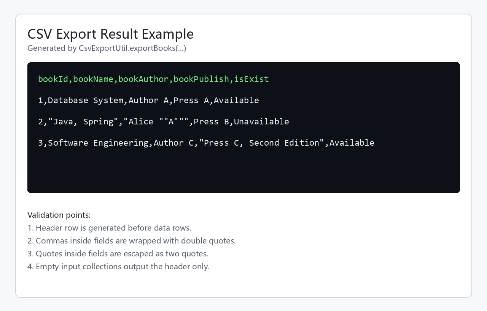

# 第11项 附加功能开发

## 1. 实践目标

附加功能开发是在核心借阅流程之外，补充能够提升系统实用性的功能。本项围绕两个方向展开：

1. 搜索筛选：让用户或管理员能够按关键词、分类和分页条件快速定位图书或记录。
2. 数据导出：将图书查询结果、借阅记录等业务数据整理为 CSV 文本，便于下载、归档、统计或交给表格软件处理。

附加功能不改变系统核心业务规则。借书、还书、登录、账号维护仍由原业务模块负责；附加功能只在已有数据基础上提供更便捷的查询、筛选和导出能力。

## 2. 功能范围

| 功能 | 使用对象 | 功能说明 | 实现位置 |
| --- | --- | --- | --- |
| 图书关键词搜索 | 读者 | 按图书名称的部分关键字查询图书 | `IBookService.selectBooksByBookPartInfo` |
| 图书分类筛选 | 管理员 | 按分类编号分页查看图书 | `IBookService.findBooksByCategoryId` |
| 分类下拉加载 | 管理员 | 进入图书管理页时加载所有分类 | `scripts/admin/showBooks.js` |
| 分页边界控制 | 管理员 | 防止上一页、下一页跳转到无效页码 | `scripts/admin/showBooks.js`、`scripts/admin/showUsers.js` |
| 图书结果导出 | 管理员或读者 | 将图书查询结果转换为 CSV | `CsvExportUtil.exportBooks` |
| 借阅记录导出 | 管理员 | 将借阅记录转换为 CSV | `CsvExportUtil.exportBorrowingRecords` |

## 3. 搜索筛选功能分析

### 3.1 图书关键词搜索

图书关键词搜索用于读者查询图书。输入关键字后，服务层将关键字转换为模糊查询条件，再交给数据访问层查询数据库。

服务接口：

```java
List<BookVo> selectBooksByBookPartInfo(String partInfo);
```

实现逻辑：

1. 接收用户输入的图书关键字。
2. 在关键字前后拼接 `%`，形成 SQL `LIKE` 模糊查询条件。
3. 查询图书基础信息。
4. 对每一本图书查询借阅记录。
5. 如果没有借阅记录，标记为可借。
6. 如果存在借阅记录，标记为不可借。
7. 将图书编号、书名、作者、出版社、借阅状态封装到 `BookVo` 返回。

核心代码结构：

```java
public List<BookVo> selectBooksByBookPartInfo(String partInfo) {
    List<BookVo> bookVos = new LinkedList<>();
    List<Book> books = bookMapper.selectBooksByPartInfo("%" + partInfo + "%");

    if (null == books) {
        return bookVos;
    }

    for (Book b : books) {
        BookVo bookVo = new BookVo();
        bookVo.setBookId(b.getBookId());
        bookVo.setBookName(b.getBookName());
        bookVo.setBookAuthor(b.getBookAuthor());
        bookVo.setBookPublish(b.getBookPublish());
        // 根据借阅记录判断图书是否可借
        bookVos.add(bookVo);
    }
    return bookVos;
}
```

对应 SQL：

```xml
<select id="selectBooksByPartInfo" parameterType="java.lang.String" resultMap="BaseResultMap">
    select
    <include refid="Base_Column_List"/>
    from book
    where book_name LIKE #{bookPartInfo}
</select>
```

该功能的特点是实现简单、响应直接，适合读者在图书数量较多时快速检索目标图书。

### 3.2 图书分类筛选

图书分类筛选用于管理员图书管理页面。管理员选择分类后，后端按分类编号查询对应图书，并按每页固定数量分页返回。

服务接口：

```java
Page<BookVo> findBooksByCategoryId(int categoryId, int pageNum);
```

实现逻辑：

1. 接收分类编号和当前页码。
2. 根据页码计算数据库查询起始位置。
3. 每页查询 10 条图书数据。
4. 将图书实体转换为 `BookVo`。
5. 查询每本图书的借阅状态。
6. 查询该分类下图书总数。
7. 根据总数计算总页数。
8. 返回带有列表、当前页、每页数量、总页数的 `Page<BookVo>`。

分页 SQL：

```xml
<select id="selectByCategoryId" resultMap="BaseResultMap">
    select *
    from book
    where book_category = #{categoryId}
    limit #{currIndex},#{pageSize}
</select>
```

总数 SQL：

```xml
<select id="selectBookCountByCategoryId" resultType="Integer">
    select count(*)
    from book
    where book_category = #{categoryId}
</select>
```

分类筛选可以减少管理员浏览数据的范围，避免所有图书一次性展示造成页面拥挤。

### 3.3 分类下拉框加载

管理员图书管理页面需要从后端获取分类列表，再填充到筛选下拉框中。

前端脚本：

```javascript
function findAllBookCategory() {
    $.ajax({
        async: false,
        type: "post",
        url: "/findAllBookCategory",
        dataType: "json",
        success: function (data) {
            $("select[name='bookCategory']").empty();
            for (let i = 0; i < data.length; i++) {
                let html = '<option value="' + data[i].categoryId + '">';
                html += data[i].categoryName + '</option>';
                $("select[name='bookCategory']").append(html);
            }
        }
    });
}
```

该功能使页面筛选项与数据库中的分类数据保持一致。新增或删除分类后，页面重新加载即可获取最新分类。

### 3.4 分页边界控制

分页边界控制属于前端增强功能。它不改变后端查询逻辑，但可以减少无效请求。

处理规则：

1. 当前页为第一页时，点击上一页不再请求后端。
2. 当前页为最后一页时，点击下一页不再请求后端。
3. 越界时使用弹窗提示用户。
4. 正常页码才允许继续跳转。

该功能提升了列表页面的可用性，也避免后端接收明显无效的页码请求。

## 4. 数据导出功能设计

### 4.1 设计原因

图书管理系统中的图书列表和借阅记录具有统计、归档和核对价值。管理员可能需要将数据导出后进行表格统计，例如：

1. 导出某类图书的清单。
2. 导出当前借阅记录。
3. 统计不可借图书数量。
4. 核对读者借阅情况。
5. 作为阶段性数据备份。

CSV 格式适合该场景，原因是格式简单、体积小、可直接被常见表格软件打开，也不需要额外引入复杂依赖。

### 4.2 导出工具类

新增工具类：

```java
com.zbw.utils.export.CsvExportUtil
```

该工具类提供两个导出方法：

| 方法 | 输入 | 输出 | 用途 |
| --- | --- | --- | --- |
| `exportBooks(List<BookVo> books)` | 图书视图对象列表 | CSV 字符串 | 导出图书查询结果 |
| `exportBorrowingRecords(List<BorrowingBooksVo> records)` | 借阅记录视图对象列表 | CSV 字符串 | 导出借阅记录 |

工具类不直接查询数据库，也不直接写文件。它只负责把业务层已经查询出的对象转换为 CSV 文本。这样设计的好处是职责单一，后续可以被控制器、服务层或测试代码复用。

### 4.3 图书导出代码

```java
public static String exportBooks(List<BookVo> books) {
    StringBuilder csv = new StringBuilder();
    appendRow(csv, "bookId", "bookName", "bookAuthor", "bookPublish", "isExist");
    if (books == null) {
        return csv.toString();
    }
    for (BookVo book : books) {
        appendRow(csv,
                valueOf(book == null ? null : book.getBookId()),
                valueOf(book == null ? null : book.getBookName()),
                valueOf(book == null ? null : book.getBookAuthor()),
                valueOf(book == null ? null : book.getBookPublish()),
                valueOf(book == null ? null : book.getIsExist()));
    }
    return csv.toString();
}
```

导出字段说明：

| 字段 | 含义 |
| --- | --- |
| `bookId` | 图书编号 |
| `bookName` | 图书名称 |
| `bookAuthor` | 作者 |
| `bookPublish` | 出版社 |
| `isExist` | 当前是否可借 |

### 4.4 借阅记录导出代码

```java
public static String exportBorrowingRecords(List<BorrowingBooksVo> records) {
    StringBuilder csv = new StringBuilder();
    appendRow(csv, "userId", "userName", "bookId", "bookName", "dateOfBorrowing", "dateOfReturn");
    if (records == null) {
        return csv.toString();
    }
    for (BorrowingBooksVo record : records) {
        User user = record == null ? null : record.getUser();
        Book book = record == null ? null : record.getBook();
        appendRow(csv,
                valueOf(user == null ? null : user.getUserId()),
                valueOf(user == null ? null : user.getUserName()),
                valueOf(book == null ? null : book.getBookId()),
                valueOf(book == null ? null : book.getBookName()),
                valueOf(record == null ? null : record.getDateOfBorrowing()),
                valueOf(record == null ? null : record.getDateOfReturn()));
    }
    return csv.toString();
}
```

导出字段说明：

| 字段 | 含义 |
| --- | --- |
| `userId` | 读者编号 |
| `userName` | 读者姓名 |
| `bookId` | 图书编号 |
| `bookName` | 图书名称 |
| `dateOfBorrowing` | 借书日期 |
| `dateOfReturn` | 应还日期 |

### 4.5 CSV 转义处理

CSV 导出不能简单地用逗号拼接字段。如果字段本身包含逗号、双引号或换行，直接拼接会破坏表格结构。

本次实现加入了转义规则：

1. 空值导出为空字符串。
2. 字段包含逗号时，用双引号包裹。
3. 字段包含双引号时，将一个双引号转义为两个双引号。
4. 字段包含换行时，用双引号包裹。
5. 每条记录后追加系统换行符。

转义代码：

```java
private static String escape(String value) {
    if (value == null) {
        return "";
    }
    boolean shouldQuote = value.contains(",")
            || value.contains("\"")
            || value.contains("\n")
            || value.contains("\r");
    String escaped = value.replace("\"", "\"\"");
    return shouldQuote ? "\"" + escaped + "\"" : escaped;
}
```

该处理可以保证导出的 CSV 在常见表格软件中保持正确列结构。

## 5. 后续下载接口接入方案

当前导出工具已经完成数据转换。如果需要在页面上提供“导出”按钮，可按以下方式接入：

1. 控制器接收导出请求。
2. 控制器调用现有服务查询图书或借阅记录。
3. 调用 `CsvExportUtil` 生成 CSV 文本。
4. 设置响应头 `Content-Type: text/csv;charset=UTF-8`。
5. 设置响应头 `Content-Disposition` 指定下载文件名。
6. 将 CSV 内容写入 HTTP 响应体。

示例结构：

```java
@GetMapping("/exportBooks")
public void exportBooks(String partInfo, HttpServletResponse response) throws IOException {
    List<BookVo> books = bookService.selectBooksByBookPartInfo(partInfo);
    String csv = CsvExportUtil.exportBooks(books);

    response.setContentType("text/csv;charset=UTF-8");
    response.setHeader("Content-Disposition", "attachment; filename=books.csv");
    response.getWriter().write(csv);
}
```

该接口只负责下载，不直接实现查询细节。查询逻辑仍复用业务层已有方法。

## 6. 测试用例

新增测试类：

```java
com.zbw.CsvExportUtilTest
```

测试用例包括：

| 编号 | 测试方法 | 测试目标 | 预期结果 |
| --- | --- | --- | --- |
| ADD-01 | `exportBooksWritesHeaderAndRows` | 导出普通图书列表 | 输出表头和图书数据行 |
| ADD-02 | `exportBooksEscapesCommaQuoteAndLineBreak` | 导出包含逗号、引号、换行的字段 | 字段被正确加引号和转义 |
| ADD-03 | `exportBorrowingRecordsWritesUserBookAndDates` | 导出借阅记录 | 输出读者、图书、借阅日期、应还日期 |
| ADD-04 | `exportNullCollectionsWritesOnlyHeader` | 导出空集合 | 只输出表头，不抛异常 |

测试代码示例：

```java
@Test
public void exportBooksEscapesCommaQuoteAndLineBreak() {
    List<BookVo> books = new ArrayList<>();
    BookVo book = new BookVo();
    book.setBookId(2);
    book.setBookName("Java, Spring");
    book.setBookAuthor("Alice \"A\"");
    book.setBookPublish("Press\r\nB");
    book.setIsExist("Unavailable");
    books.add(book);

    String csv = CsvExportUtil.exportBooks(books);

    assertTrue(csv.contains("\"Java, Spring\""));
    assertTrue(csv.contains("\"Alice \"\"A\"\"\""));
    assertTrue(csv.contains("\"Press\r\nB\""));
}
```

测试命令：

```bash
mvn test
```

当前终端环境未识别 `mvn` 命令，说明 Maven 未加入命令行 PATH，且项目中未提供 Maven Wrapper。测试代码已经补充到测试目录；在已配置 Maven 的开发环境中执行上述命令即可运行。

## 7. 功能截图与结果图

### 7.1 图书关键词搜索页面

图书关键词搜索页面提供输入框和查询按钮，读者输入图书名称关键字后，系统根据关键字查询匹配图书，并展示图书编号、书名、作者、出版社和可借状态。


该页面对应的附加功能是图书搜索。它体现了“按关键字筛选图书”的用户入口，后端通过 `selectBooksByBookPartInfo` 完成模糊查询。

### 7.2 管理员图书分类筛选页面

管理员图书管理页面包含分类筛选和分页展示。管理员可以按图书分类查看图书列表，也可以通过上一页、下一页进行分页浏览。


该页面对应的附加功能是分类筛选和分页边界控制。分类数据由前端脚本请求后端接口加载，分页跳转前会判断当前页是否已经到达边界。

### 7.3 管理员借阅记录页面

管理员借阅记录页面用于查看读者借阅情况，页面数据可以作为借阅记录导出的数据来源。


该页面对应的附加功能是借阅记录统计和导出前的数据展示。借阅记录导出时，可将页面对应的读者、图书、借书日期、应还日期整理为 CSV。

### 7.4 CSV 导出结果示例

CSV 导出结果示例展示了导出后的表头、普通数据行，以及包含逗号和引号的字段转义效果。



该结果图对应 `CsvExportUtil.exportBooks` 的输出格式。导出工具会先生成表头，再逐行写入数据；当字段中包含逗号、引号或换行时，会按照 CSV 规则进行转义。

## 8. 质量分析

本项附加功能具备以下特点：

1. 搜索筛选复用现有业务层和数据访问层，避免重复查询逻辑。
2. 分类筛选加入分页，避免一次性加载过多图书数据。
3. 前端分页边界判断减少无效请求。
4. CSV 导出工具与数据库、Web 层解耦，便于测试和复用。
5. CSV 导出考虑了逗号、引号、换行和空值，避免导出文件结构损坏。

仍可继续改进的点：

1. 搜索功能目前主要按图书名称模糊查询，后续可扩展到作者、出版社、分类组合查询。
2. 导出工具已经生成 CSV 文本，但下载接口需要在控制器中接入。
3. 导出文件如果包含中文，在部分表格软件中可能需要增加 UTF-8 BOM 或明确编码导入方式。
4. 前端可以增加“导出当前筛选结果”按钮，将当前查询条件传给下载接口。

## 9. 产出物

本项产出包括：

1. 搜索筛选功能实现分析。
2. 分类筛选和分页边界控制说明。
3. CSV 数据导出工具类 `CsvExportUtil`。
4. CSV 导出单元测试 `CsvExportUtilTest`。
5. 后续下载接口接入方案。
6. 附加功能截图和导出结果图。
7. 附加功能质量分析和改进方向。
