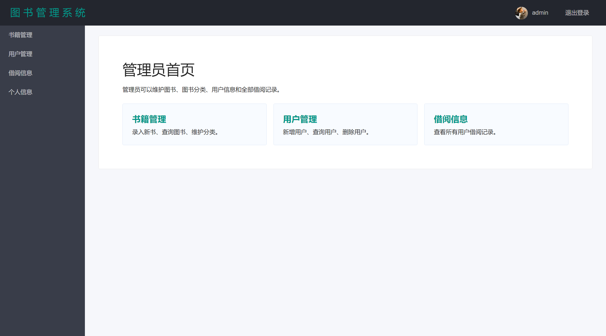
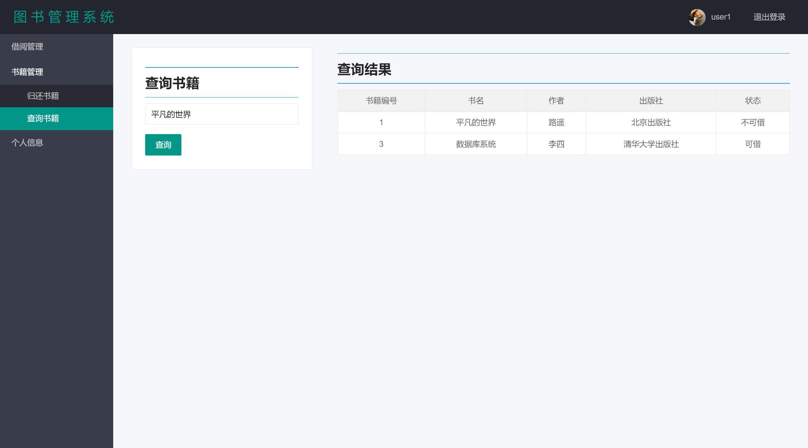
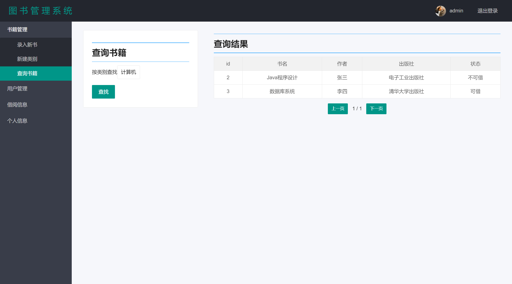

# 第12项 系统初版整合

## 1. 实践目标

系统初版整合的目标是把前端页面、后端接口、业务逻辑、数据访问、数据库脚本、测试用例和附加功能合并为一个结构完整的可运行版本。该版本应能够完成图书管理系统的主要业务流程，并具备后续测试、演示和继续迭代的基础。

本项整合重点包括：

1. 前端页面与静态资源整合。
2. 后端控制器、业务层、数据访问层整合。
3. 数据库配置和建表脚本整合。
4. 用户端、管理员端核心流程整合。
5. 附加功能与导出能力整合。
6. 测试用例、测试结果和页面截图整合。
7. 初版运行步骤和远程仓库提交步骤整理。

## 2. 初版系统组成

| 模块 | 内容 | 整合状态 |
| --- | --- | --- |
| 登录模块 | 用户登录、管理员登录、退出登录 | 已整合 |
| 用户端页面 | 首页、图书查询、借书、还书、借阅记录、个人信息 | 已整合 |
| 管理员端页面 | 首页、录入新书、新建分类、图书查询、用户管理、借阅记录、管理员信息 | 已整合 |
| 控制器层 | 页面路由、表单提交、AJAX 接口、CSV 下载接口 | 已补齐 |
| 业务逻辑层 | 登录校验、借书、还书、用户维护、图书查询、分类查询 | 已整合 |
| 数据访问层 | MyBatis Mapper 接口与 XML SQL 映射 | 已整合 |
| 数据库脚本 | 建库、建表、初始化数据 | 已整合 |
| 前端交互 | jQuery AJAX、Layui 弹窗、分页控制、表单提交 | 已整合 |
| 附加功能 | 搜索筛选、CSV 导出工具、导出测试 | 已整合 |
| 测试用例 | Mapper、Service、业务流程、导出工具测试 | 已整合 |

## 3. 整合后的系统结构

```text
src
  main
    java
      com.zbw
        controller        页面路由和接口入口
        domain            实体类和视图对象
        mapper            MyBatis 数据访问接口
        service           业务接口
        service.impl      业务实现
        utils             分页工具和导出工具
    resources
      mapper              MyBatis XML SQL 映射
      db                  数据库建表和初始化脚本
      static              CSS、图片、Layui、JavaScript
      templates           Thymeleaf 页面模板
  test
    java                  单元测试和业务测试
    resources             测试数据库脚本和测试配置
```

整合后项目保持典型的 Spring Boot 分层结构。页面层不直接访问数据库，控制器层只负责接收请求和组织返回结果，业务层处理规则判断，数据访问层负责 SQL 执行。

## 4. 控制器层整合

主代码中新增控制器：

```java
com.zbw.controller.LibraryController
```

该控制器承担系统初版的统一入口，覆盖页面跳转、表单请求、AJAX 请求和 CSV 下载。

### 4.1 登录与退出接口

| 请求 | 方法 | 作用 | 返回 |
| --- | --- | --- | --- |
| `/`、`/index` | GET | 打开登录页 | `index` |
| `/userLogin` | POST | 用户登录 | 成功进入用户首页，失败返回登录页 |
| `/adminLogin` | POST | 管理员登录 | 成功进入管理员首页，失败返回登录页 |
| `/userLogOut` | GET | 用户退出登录 | 登录页 |
| `/adminLogOut` | GET | 管理员退出登录 | 登录页 |

登录成功后，控制器会把用户对象或管理员对象写入 Session。页面头部通过 Session 读取当前登录身份并显示名称。

### 4.2 管理员页面路由

| 请求 | 作用 | 页面 |
| --- | --- | --- |
| `/adminIndexPage` | 管理员首页 | `admin/index` |
| `/addBookPage` | 录入新书页面 | `admin/addBook` |
| `/addCategoryPage` | 图书分类维护页面 | `admin/addCategory` |
| `/showBooksPage` | 图书查询页面 | `admin/showBooks` |
| `/showUsersPage` | 用户管理页面 | `admin/showUsers` |
| `/addUserPage` | 新增用户页面 | `admin/addUser` |
| `/allBorrowBooksRecordPage` | 全部借阅记录页面 | `admin/allBorrowingBooksRecord` |
| `/adminInfoPage` | 管理员个人信息页面 | `admin/adminInfo` |

管理员页面需要的分页数据由控制器在进入页面前查询并放入模型。例如用户列表页面使用 `page` 作为分页模型，图书分类页面也使用 `page` 作为分页模型。

### 4.3 用户页面路由

| 请求 | 作用 | 页面 |
| --- | --- | --- |
| `/userIndexPage` | 用户首页 | `user/index` |
| `/userBorrowBookRecord` | 用户借阅记录 | `user/borrowingBooksRecord` |
| `/borrowingPage` | 借书页面 | `user/borrowingBooks` |
| `/userReturnBooksPage` | 还书页面 | `user/returnBooks` |
| `/findBookPage` | 图书查询页面 | `user/findBook` |
| `/findBookByBookPartInfo` | 按关键字查询图书 | `user/findBook` |
| `/userMessagePage` | 用户个人信息页面 | `user/userMessage` |

用户页面主要围绕借阅流程展开，包括查询图书、借书、还书、查看借阅记录和修改个人资料。

### 4.4 AJAX 接口整合

| 请求 | 方法 | 前端调用位置 | 后端处理 |
| --- | --- | --- | --- |
| `/addBook` | POST | `addBook.js` | 新增图书 |
| `/findAllBookCategory` | POST | `addBook.js`、`showBooks.js` | 返回所有图书分类 |
| `/addBookCategory` | POST | `addBookCategory.js` | 新增图书分类 |
| `/deleteCategory` | POST | `addBookCategory.js` | 删除图书分类 |
| `/addUser` | POST | `addUser.js` | 新增用户 |
| `/deleteUser` | POST | `showUsers.js` | 删除用户 |
| `/updateAdmin` | POST | `adminInfo.js` | 修改管理员信息 |
| `/updateUser` | POST | `userMessage.js` | 修改用户信息 |
| `/userBorrowingBook` | POST | `borrowingBook.js` | 借书 |
| `/userReturnBook` | POST | `returnBook.js` | 还书 |

这些接口返回布尔值或 JSON 数据，前端根据返回结果显示成功、失败或异常提示。

### 4.5 导出接口整合

| 请求 | 方法 | 作用 |
| --- | --- | --- |
| `/exportBooks` | GET | 按图书关键字导出图书查询结果 CSV |
| `/exportBorrowingRecords` | GET | 导出指定页借阅记录 CSV |

导出接口复用第 11 项新增的 `CsvExportUtil`。控制器只负责查询数据、生成 CSV、设置响应头和写入响应体。

## 5. 前端整合

前端整合采用 Thymeleaf 页面模板、Layui 组件和 jQuery AJAX。页面分为登录入口、用户端和管理员端。

### 5.1 登录入口

登录入口提供用户身份选择。选择普通用户时提交到 `/userLogin`，选择管理员时提交到 `/adminLogin`。


### 5.2 用户端首页

用户登录后进入用户端首页。用户端菜单包含借阅记录、借阅图书、归还图书、查询图书和个人信息。


### 5.3 管理员端首页

管理员登录后进入管理员端首页。管理员端菜单包含图书管理、用户管理、借阅信息和个人信息。



### 5.4 图书查询页面

图书查询页面体现前端页面、控制器、业务层和数据访问层的完整调用链。用户输入关键字后，后端按图书名称模糊查询，并返回查询结果。



### 5.5 管理员图书管理页面

管理员图书管理页面体现分类加载、分类筛选、分页查询和图书状态展示。



## 6. 后端整合

后端整合后的调用链如下：

```text
浏览器页面
  -> Controller 接收请求
  -> Service 执行业务规则
  -> Mapper 调用 SQL
  -> MySQL 返回数据
  -> Service 封装结果
  -> Controller 返回页面或 JSON
  -> 前端展示结果
```

典型流程：

| 流程 | 调用链 |
| --- | --- |
| 用户登录 | `/userLogin` -> `IUserService.userLogin` -> `UserMapper` |
| 管理员登录 | `/adminLogin` -> `IAdminService.adminLogin` -> `AdminMapper` |
| 图书查询 | `/findBookByBookPartInfo` -> `IBookService.selectBooksByBookPartInfo` -> `BookMapper` |
| 分类筛选 | `/showBooksResultPageByCategoryId` -> `IBookService.findBooksByCategoryId` -> `BookMapper` |
| 借书 | `/userBorrowingBook` -> `IUserService.userBorrowingBook` -> `BorrowingBooksMapper` |
| 还书 | `/userReturnBook` -> `IUserService.userReturnBook` -> `BorrowingBooksMapper` |
| 借阅记录 | `/allBorrowBooksRecordPage` -> `IBorrowingBooksRecordService.selectAllByPage` -> 多个 Mapper |
| CSV 导出 | `/exportBooks` 或 `/exportBorrowingRecords` -> `CsvExportUtil` |

## 7. 数据库整合

系统使用 MySQL 作为后台数据库，配置项包括数据库连接地址、用户名、密码、驱动类和 MyBatis 映射文件位置。

主要数据库对象包括：

| 表 | 作用 |
| --- | --- |
| `admin` | 管理员账号信息 |
| `user` | 读者账号信息 |
| `book` | 图书基础信息 |
| `book_category` | 图书分类信息 |
| `borrowing_books` | 借阅记录 |
| `department` | 院系信息 |

数据库脚本位于项目的数据库脚本目录中，运行系统前需要先创建数据库并执行建表和初始化脚本。

## 8. 运行步骤

### 8.1 环境要求

| 软件 | 要求 |
| --- | --- |
| JDK | 1.8 或兼容版本 |
| Maven | 3.x |
| MySQL | 8.x 或兼容版本 |
| 浏览器 | Chrome、Edge 或其他现代浏览器 |

### 8.2 数据库准备

1. 启动 MySQL。
2. 创建系统数据库。
3. 执行数据库脚本目录中的 SQL 文件。
4. 修改配置文件中的数据库用户名和密码。
5. 确认数据库连接地址、端口和库名正确。

### 8.3 启动系统

```bash
mvn spring-boot:run
```

启动成功后访问：

```text
http://localhost:8080/
```

### 8.4 打包系统

```bash
mvn clean package
```

打包后可通过以下方式运行：

```bash
java -jar target/library-manager-system-1.0.0.jar
```

## 9. 验证结果

### 9.1 后端测试结果

已有后端测试覆盖 Mapper、Service、业务逻辑、借还书流程和导出工具。已有测试结果显示：

```text
Tests run: 28, Failures: 0, Errors: 0, Skipped: 0
BUILD SUCCESS
```


### 9.2 本次整合检查

| 检查项 | 结果 |
| --- | --- |
| 控制器目录 | 已补充 `LibraryController` |
| 登录路由 | 已整合 |
| 用户端页面路由 | 已整合 |
| 管理员端页面路由 | 已整合 |
| AJAX 接口 | 已整合 |
| CSV 导出接口 | 已整合 |
| 页面截图 | 已整理 |
| 测试截图 | 已整理 |
| 当前终端运行 `java -version` | 未识别 `java` 命令 |
| 当前终端运行 `mvn -version` | 未识别 `mvn` 命令 |
| 当前目录 Git 状态 | 未检测到 `.git` 目录 |

由于当前终端未识别 Java 和 Maven 命令，本次未在该终端完成重新启动和重新打包。系统运行需要在已配置 JDK、Maven 和 MySQL 的环境中执行。

## 10. 远程仓库提交步骤

系统初版整合完成后，应提交到远程仓库。若项目已经绑定远程仓库，可执行：

```bash
git status
git add .
git commit -m "integrate runnable initial system version"
git push
```

若项目尚未初始化 Git，可执行：

```bash
git init
git add .
git commit -m "initial integrated system version"
git remote add origin <remote-repository-url>
git push -u origin main
```

当前目录未检测到 `.git` 目录，因此未执行实际远程提交。完成远程提交需要先确认远程仓库地址和账号权限。

## 11. 初版整合结论

系统初版已经完成以下整合：

1. 前端页面与静态资源已经形成完整用户端和管理员端入口。
2. 控制器层已经补齐页面路由、AJAX 接口和 CSV 下载接口。
3. 业务层和数据访问层已经可以支撑登录、查询、借书、还书、分类、用户、借阅记录等核心流程。
4. 数据库脚本和配置文件已经纳入项目。
5. 搜索筛选和数据导出作为附加功能已经纳入初版。
6. 页面截图、测试结果和测试用例已经形成整合验证材料。

当前版本具备作为“可运行系统初版”的代码结构和功能闭环。实际运行前需要保证 JDK、Maven、MySQL 和数据库配置可用。

## 12. 产出物

本项产出包括：

1. 系统初版整合说明文档。
2. 控制器整合代码 `LibraryController`。
3. 用户端、管理员端页面路由整合。
4. AJAX 接口整合。
5. CSV 导出接口整合。
6. 初版运行步骤。
7. 初版页面截图和后端测试结果截图。
8. 远程仓库提交步骤说明。
