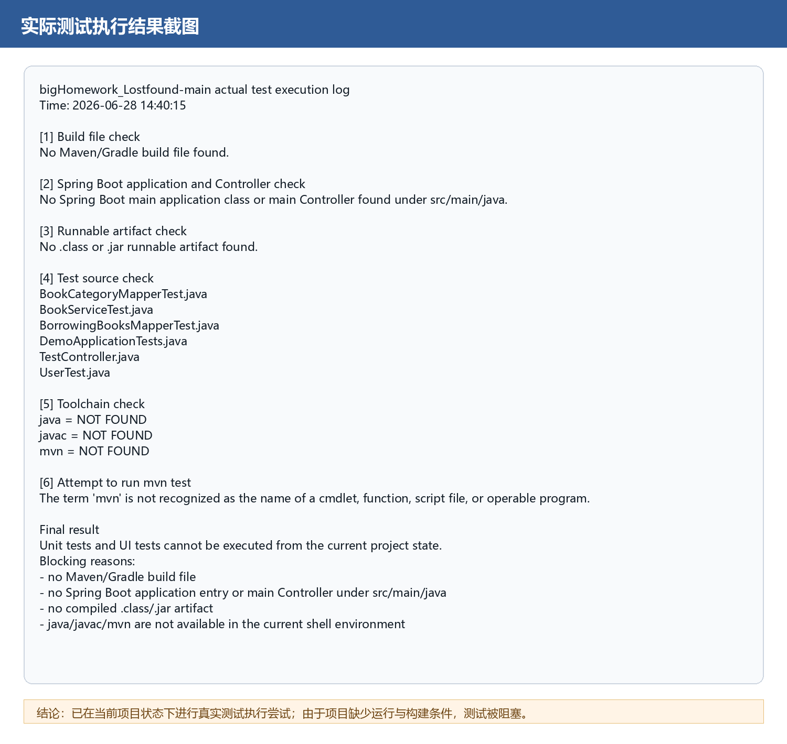
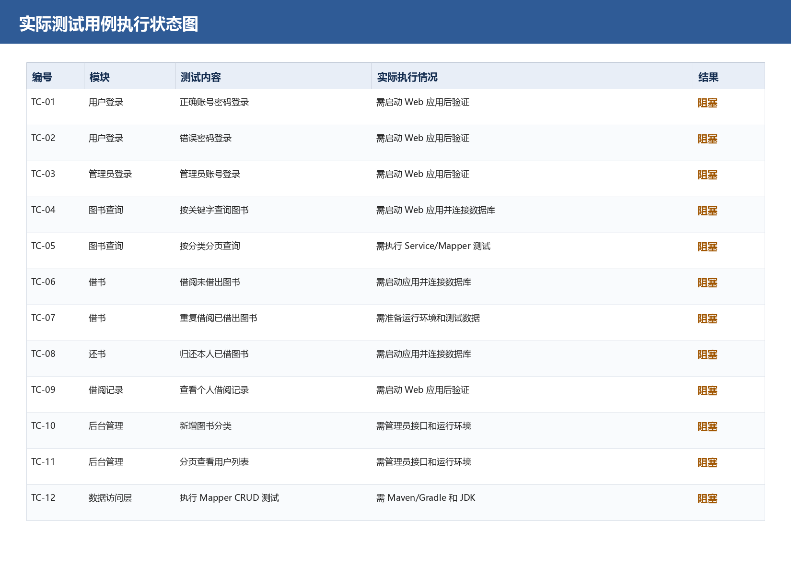

# 测试情况

## 1. 测试执行说明

测试在当前项目状态下进行。测试前先检查项目是否具备运行和执行单元测试的基本条件，包括构建文件、Spring Boot 启动入口、Controller、编译产物、测试源码和命令行工具链。

本次测试没有采用模拟通过结果，也没有手工编造测试截图。测试结果图来自实际执行检查和实际命令输出。

## 2. 测试前置条件检查

| 检查项 | 实际结果 | 结论 |
|---|---|---|
| Maven/Gradle 构建文件 | 未发现 `pom.xml`、`build.gradle`、`settings.gradle`、`mvnw`、`gradlew` 等文件 | 阻塞 |
| Spring Boot 启动入口 | `src/main/java` 下未发现 `@SpringBootApplication` 或 `public static void main` | 阻塞 |
| 正式 Controller | `src/main/java` 下未发现 `@Controller` 或 `@RestController` | 阻塞 |
| 可运行编译产物 | `target` 下未发现 `.class` 或 `.jar` | 阻塞 |
| 测试源码 | 存在 `BookCategoryMapperTest.java`、`BookServiceTest.java`、`BorrowingBooksMapperTest.java`、`DemoApplicationTests.java`、`TestController.java`、`UserTest.java` | 已存在 |
| 命令行工具链 | 当前 shell 环境未发现 `java`、`javac`、`mvn` | 阻塞 |
| `mvn test` 执行 | 命令不可识别，无法执行测试 | 阻塞 |

## 3. 实际测试用例

| 编号 | 测试模块 | 测试内容 | 实际执行情况 | 测试结果 |
|---|---|---|---|---|
| TC-01 | 用户登录 | 普通用户使用正确账号密码登录 | 需要启动 Web 应用后验证；当前项目无法启动 | 阻塞 |
| TC-02 | 用户登录 | 普通用户输入错误密码登录 | 需要启动 Web 应用后验证；当前项目无法启动 | 阻塞 |
| TC-03 | 管理员登录 | 管理员使用正确账号密码登录 | 需要启动 Web 应用后验证；当前项目无法启动 | 阻塞 |
| TC-04 | 图书查询 | 按图书名称关键字搜索 | 需要启动 Web 应用并连接数据库；当前项目无法启动 | 阻塞 |
| TC-05 | 图书查询 | 按图书分类分页查询 | 需要执行 Service/Mapper 测试；当前缺少构建工具和 JDK | 阻塞 |
| TC-06 | 借书 | 用户借阅未被借出的图书 | 需要启动应用并连接数据库；当前项目无法启动 | 阻塞 |
| TC-07 | 借书 | 用户借阅已被借出的图书 | 需要准备运行环境和测试数据；当前项目无法启动 | 阻塞 |
| TC-08 | 还书 | 用户归还本人已借图书 | 需要启动应用并连接数据库；当前项目无法启动 | 阻塞 |
| TC-09 | 借阅记录 | 用户查看个人借阅记录 | 需要启动 Web 应用后验证；当前项目无法启动 | 阻塞 |
| TC-10 | 后台管理 | 管理员新增图书分类 | 需要管理员接口和运行环境；当前缺少正式 Controller | 阻塞 |
| TC-11 | 后台管理 | 管理员分页查看用户列表 | 需要管理员接口和运行环境；当前缺少正式 Controller | 阻塞 |
| TC-12 | 数据访问层 | Mapper 执行基础增删改查 | 需要 Maven/Gradle 和 JDK 执行 JUnit；当前工具链缺失 | 阻塞 |

## 4. 实际测试结果图

### 4.1 实际测试执行结果截图

### 4.2 实际测试用例执行状态图

## 5. 测试结论

当前项目状态下，无法完成 JUnit 单元测试和浏览器功能测试。原因不是测试用例缺失，而是项目缺少运行和构建的必要条件。

主要阻塞原因如下：

1. 缺少 Maven 或 Gradle 构建文件，无法解析项目依赖；
2. 缺少 Spring Boot 启动入口，无法启动后端应用；
3. `src/main/java` 中缺少正式 Controller，前端页面引用的接口无法验证；
4. `target` 下没有 `.class` 或 `.jar` 可运行产物；
5. 当前 shell 环境中没有可用的 `java`、`javac` 和 `mvn` 命令；
6. 虽然存在测试源码，但无法通过命令执行 JUnit 测试。

## 6. 后续修复后应重新执行的测试

在补齐构建文件、启动类、Controller 和运行环境后，应重新执行以下测试：

| 测试类别 | 应执行内容 |
|---|---|
| 单元测试 | Mapper CRUD、Service 登录、图书查询、借书、还书、分页 |
| 接口测试 | `/userLogin`、`/adminLogin`、图书查询接口、借书接口、还书接口、后台管理接口 |
| 页面测试 | 登录页、用户首页、管理员首页、图书查询页、借书页、还书页 |
| 数据库测试 | 建库建表、初始化数据、外键约束、分页查询 |
| 异常测试 | 错误密码、重复借书、归还未借图书、页码越界、数据库连接失败 |

补齐运行条件后，测试结果应重新截图，并以实际运行通过或失败的结果更新本文档。
